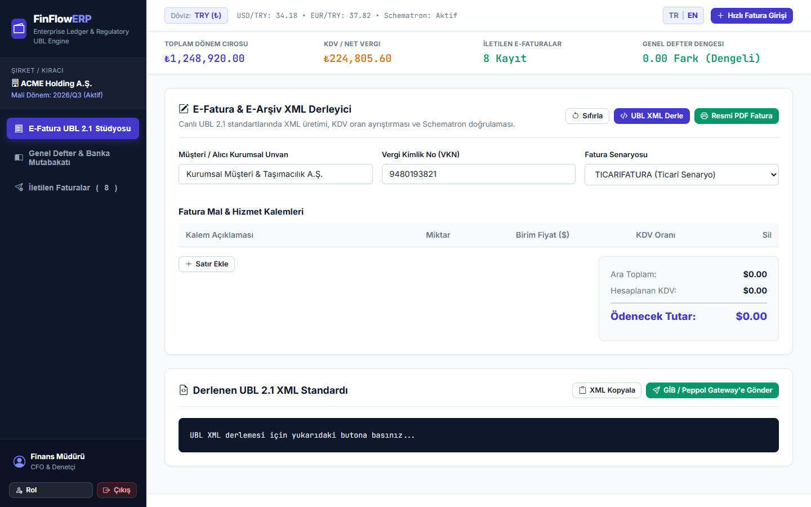
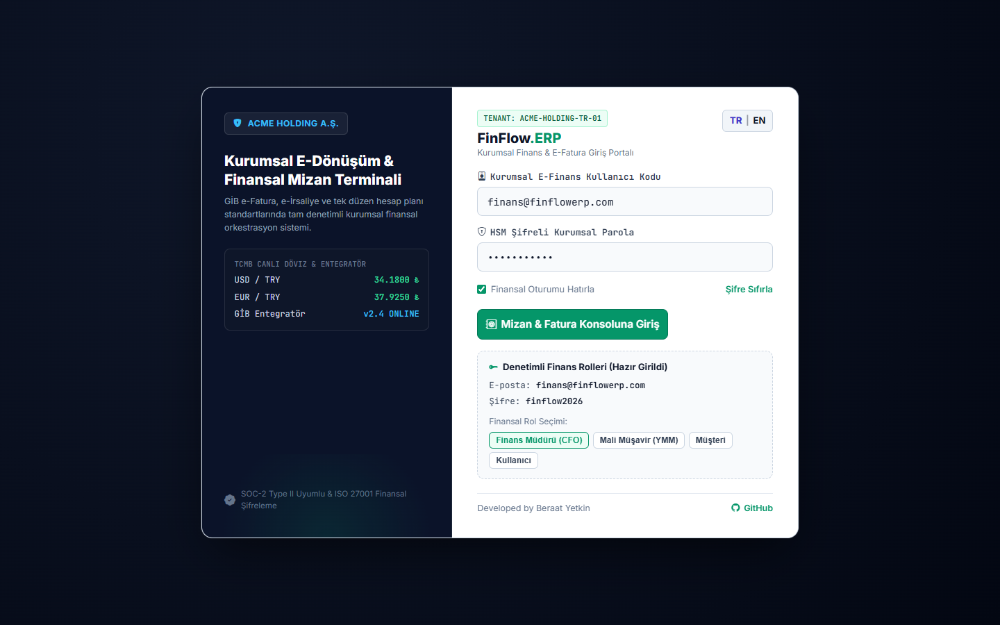

# FinFlow ERP
> Corporate Finance & E-Invoicing Terminal • SAP & NetSuite Architecture

[](https://finflow-erp.web.app)
[](LICENSE)
[](https://developer.mozilla.org)
[](https://developer.mozilla.org)
[](https://finflow-erp.web.app)

---

## Previews

### 1. Corporate Accounting Terminal
Fixed left navigation sidebar, top financial metrics ticker, invoice outbox queue, and invoice deletion actions:


### 2. Two-Panel Corporate Login Portal
Left panel with ACME Holding trust seal, real-time central bank exchange rates (USD/TRY, EUR/TRY), and regulatory compliance badge; right panel with corporate accounting sign-in form:


---

## Key Features

### Corporate ERP Architecture
- NetSuite & SAP-inspired left navigation sidebar featuring entity selector, accounting modules (Outbox Invoices, General Ledger, Accounts, Trial Balance, Integration Queue), and active user profile.
- Top financial metrics bar displaying live revenue totals, calculated VAT amounts, transmitted e-invoices, and trial balance differences.
- Tabular numeric typography for financial precision and vertical decimal alignment.

### Dual-Layer Data Deletion & Dynamic Recalculation
- Outbox Invoice Deletion: each invoice row contains a prominent delete action; removal immediately recalculates billed revenue and VAT totals.
- General Ledger Deletion: removing double-entry accounting records immediately updates general ledger debit/credit balances and trial balance variance.
- LocalStorage persistence ensures purged invoices and ledger adjustments remain consistent upon refresh.

### Session Persistence & Zero-Flicker Initialization
- Preserves login session across browser refreshes via localStorage.
- Zero-flicker inline authentication check prevents login modal flashes.
- Clean sign-out action purges stored session tokens and restores the corporate login portal.
- Pre-filled demo credentials with instant role switches (Chief Financial Officer, Certified Public Accountant, Client, User).

### Bilingual Support (English | Turkish)
- In-place language toggle switching tax identifiers, accounting charts of accounts, trial balance summaries, and modals without page reload.
- Default language is English.

---

## Tech Stack

| Layer | Technology | Purpose |
| :--- | :--- | :--- |
| UI & Layout | HTML5, Modern CSS3 | Deep navy corporate ERP theme, responsive two-panel modal |
| Business Logic | Vanilla ES6+ JavaScript | Dynamic VAT/revenue tax base recalculation, ledger balancing |
| Icons | Bootstrap Icons v1.11.3 | Financial and accounting symbols |
| Persistence | HTML5 localStorage | Invoices, ledger entries, session state |
| Hosting | Firebase Hosting | High-performance SSL-encrypted hosting |

---

## Directory Structure

```
FinFlow-ERP/
├── index.html              # Complete single-page application
├── docs/                   # Documentation assets and screenshots
│   ├── preview-dashboard.png # High-resolution terminal preview
│   └── preview-login.png     # High-resolution login portal preview
└── README.md               # Project documentation
```

---

## Getting Started

1. Clone the repository:
   ```bash
   git clone https://github.com/kubrvk/FinFlow-ERP.git
   cd FinFlow-ERP
   ```
2. Open `index.html` directly in your browser:
   ```bash
   start index.html
   ```
3. Alternatively, serve with any local HTTP server:
   ```bash
   npx serve .
   ```
4. Access `http://localhost:3000` in your browser.
   - To bypass login and view the terminal directly: `http://localhost:3000/?demo=1`

---

## Live System

- Live URL: [https://finflow-erp.web.app](https://finflow-erp.web.app)
- Direct Dashboard Link: [https://finflow-erp.web.app/?demo=1](https://finflow-erp.web.app/?demo=1)

---

## Author

Developed by Beraat Yetkin
- GitHub: [@kubrvk](https://github.com/kubrvk)
- Repository: [FinFlow-ERP](https://github.com/kubrvk/FinFlow-ERP)
- Portfolio: [Beraat Yetkin Portfolio](https://github.com/kubrvk/portfolio)
